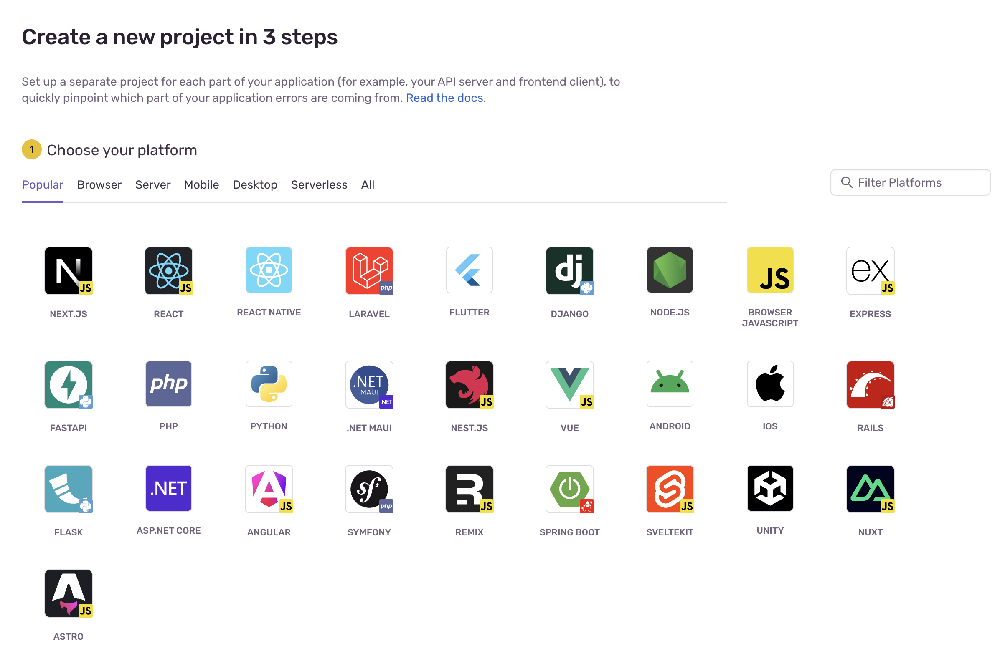

# Sentry Self-Hosted Monitoring Setup

## 📌 Project Overview

This project involves setting up **Sentry** as a centralized error and performance monitoring solution for modern applications. It demonstrates my ability to proactively detect, triage, and resolve issues in production systems improving overall reliability and reducing Mean Time to Recovery (MTTR). 

---

## ❓ Why Sentry?

### 🚨 Problem
Many engineering teams suffer from:
- **Delayed awareness of production issues**
- **Lack of visibility into root causes**
- **Manual bug reporting or monitoring gaps**
- **Slow incident response cycles**

These challenges lead to:
- **Frustrated users**
- **Increased downtime**
- **Reduced confidence in the product**
- **Higher operational costs**

### ✅ Solution: Sentry

> Sentry is a leading open-source error monitoring and performance analysis tool that helps developers **identify, triage, and resolve issues faster** across web, mobile, and backend applications.

        
Sentry enables:
- **Real-time error tracking across frontend, backend, and mobile**
- **Detailed stack traces for faster debugging**
- **Performance monitoring for tracing slow transactions**
- **Custom alerting to notify the right teams instantly**

By deploying **self-hosted Sentry**, we:
- Maintain full control over data (important for compliance-focused environments)
- Avoid vendor lock-in
- Integrate seamlessly into our observability and DevOps stack

---

## 🚀 Business Value

| Impact Area                 | Outcome                                                                                                                 |
| --------------------------- | ----------------------------------------------------------------------------------------------------------------------- |
| **Developer Efficiency**    | Developers spend less time debugging and more time building features, reducing mean time to resolution (MTTR).          |
| **Product Quality**         | Proactive error tracking reduces user-facing bugs and improves customer experience.                                     |
| **Operational Visibility**  | Sentry integrates with logs and traces to give full-stack visibility, helping ops and SREs pinpoint problems.           |
| **Cost Optimization**       | Self-hosting avoids recurring SaaS costs, while MicroK8s offers a lightweight and scalable platform for internal teams. |
| **Security and Compliance** | Keeps sensitive logs and error traces within internal infrastructure—ideal for regulated industries.                    |

---

## ⚙️ Technologies Used

- **Sentry (Self-Hosted)** – Error tracking and performance monitoring
- **Docker / Docker Compose** – Container orchestration for rapid setup
- **PostgreSQL** – Persistent store for Sentry metadata
- **ClickHouse, Kafka** – Required for performance and event ingestion
- **Nginx** – Reverse proxy for secure access
- **MicroK8s** – Lightweight Kubernetes for local and edge deployments
- **Helm** – Kubernetes package manager used to deploy Sentry
- **Redis** – Queuing and caching for Sentry
- **Nginx Ingress Controller** – Routing traffic to Sentry web interface
- **Persistent Volumes** – For storing sentry data, logs, etc.

---

## 🔌 Integrations

* **Frontend (JS, React, Vue)**: Easy setup via SDK
* **Backend (Python, Node.js, Elixir, etc.)**
* **Dev Tools**: Slack, GitHub, Jira, Opsgenie
* **Prometheus**: Export metrics for performance observability

---

## 📈 Dashboards & Alerts

* Dashboards created to track error frequency, affected users, and release regressions.
* Alerts set up for critical services with escalation rules to on-call engineers.

|  |  |
|:------------------------------:|:------------------------:|
| **Create a New Project**       | **Setup Error Tracking with SDK** |

|        |  |
|:------------------------------:|:---------------------------:|
| **Capturing App Errors** | **Replay & Debug Errors**  |

## 🏁 Future Work

* Automate setup via Ansible or Terraform
* Fine-grained role-based access control (RBAC)

---

## 👩🏾‍💻 About Me

I'm a passionate Site Reliability Engineer focused on improving software delivery through reliability, observability, and automation. This project reflects my approach to solving real-world operational problems and creating tangible business value.

---

## 📬 Contact

* 🔗 [LinkedIn](https://www.linkedin.com/in/wendy-nina/)
* 🧑‍💻 [GitHub](https://github.com/NinaWendy)
