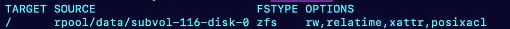

## Docker Build Error: Permission Denied

**Error Message:**
```
ERROR: failed to solve: failed to read dockerfile: failed to mount /var/lib/docker/tmp/buildkit-mount887896231: [{Type:bind Source:/var/lib/docker/vfs/dir/terfrwcpjgdszcfo3ty6xafku Target: Options:[rbind ro]}]: permission denied
```

### Root Cause

This error occurs when running Docker inside an LXC container on Proxmox, rather than on a full virtual machine (VM).

```bash
$ findmnt /
```
- EXT4


- ZFS


Docker BuildKit has known issues with ZFS, especially with bind mounts and read-only overlays used during `docker compose build`.

### Solution

**Install Sentry using Docker on a full VM.**

> **Note:**  
> Sentry self-hosted only supports Docker installation. It is designed to be Docker-first, and there is no officially supported “bare-metal” (non-Docker) installation path. Consider this when setting up your own Sentry instance.


